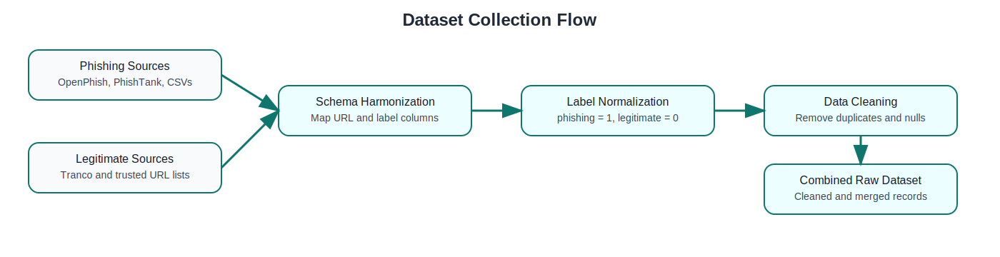
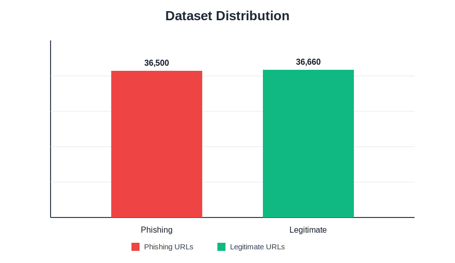
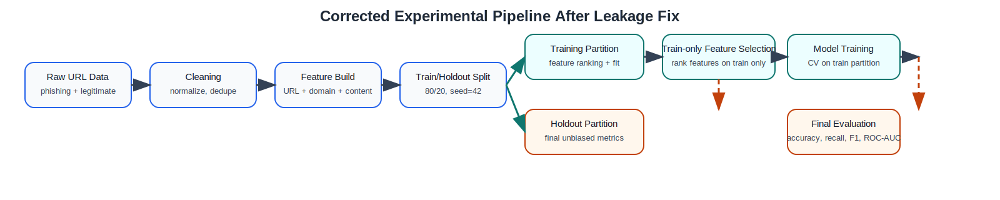
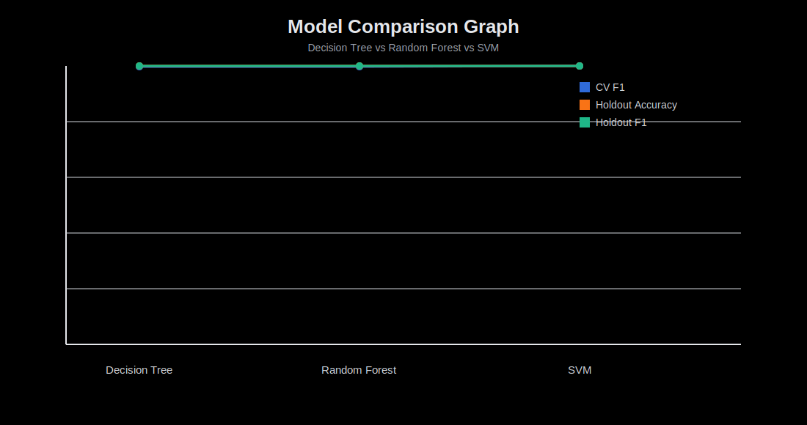

# AI-Based Phishing Website Detection System

## 1. Project Overview
This project is a full-stack phishing website detection platform built with supervised machine learning. It classifies URLs into two classes:
- phishing
- legitimate

The system combines hybrid feature engineering and live prediction:
- URL lexical features
- domain/WHOIS features
- optional live content scraping features

The project includes:
- a backend ML pipeline and Flask API
- a frontend React interface
- saved model artifacts and reports
- tests for key detection components

## 2. Objectives
- Detect phishing websites accurately in real time.
- Use multiple feature families to improve robustness.
- Support reproducible training and evaluation.
- Provide a user-friendly interface for classification.
- Generate dissertation-ready outputs (reports and comparisons).

## 3. Technology Stack
### Backend
- Python 3
- Flask
- scikit-learn
- pandas, numpy
- beautifulsoup4, requests
- python-whois, tldextract

### Frontend
- React
- Vite
- Axios

### Testing
- pytest

## 4. Repository Structure
- backend/: ML pipeline, API, data, models, reports, tests
- frontend/: React UI and API client
- start-dev.ps1: one-command local startup script
- README.md: quick project guide
- PROJECT_DOCUMENTATION.md: this full documentation

## 5. System Architecture
The platform follows a layered architecture.

### 5.1 Presentation Layer
- React frontend accepts URL input and displays prediction results.

### 5.2 API Layer
- Flask API exposes:
- GET /health
- POST /api/predict

### 5.3 Intelligence Layer
- Feature extraction engine computes URL, domain, and content features.
- Preprocessor transforms features to model-ready format.
- Best trained model predicts phishing probability.
- Risk heuristics handle high-risk patterns (for example typo-brand domains).

### 5.4 Data and Artifact Layer
- Raw and processed datasets in backend/data.
- Trained artifacts in backend/models.
- Evaluation outputs in backend/reports.
- Operational logs in backend/logs.

## 6. End-to-End Workflow
### 6.1 Offline Training Workflow
1. Load phishing and legitimate URL data.
2. Clean and normalize records.
3. Build hybrid feature dataset.
4. Rank/select informative features.
5. Train candidate models.
6. Compare performance and choose best model.
7. Save model, preprocessor, and selected features.
8. Generate reports and figures.

### 6.2 Online Prediction Workflow
1. User submits URL from frontend.
2. Frontend sends request to Flask API.
3. Backend validates input.
4. Backend extracts URL/domain/content features.
5. Features are aligned with selected schema.
6. Preprocessor transforms feature row.
7. Model predicts class and probability.
8. API returns label, confidence, and key feature summary.

## 7. Data Pipeline Details
### 7.1 Data Sources
The project supports phishing and legitimate URL CSV sources and schema normalization for common column names.

### 7.1.1 Dataset Collection Flow (Picture)



If your editor does not render SVG previews, open [backend/reports/figures/dataset_collection_flow.svg](backend/reports/figures/dataset_collection_flow.svg).

### 7.1.2 Dataset Distribution Chart (Phishing vs Legitimate)

The raw CSV files currently contain the following records:

| Class | Records |
| --- | ---: |
| Phishing | 36,500 |
| Legitimate | 36,660 |



If your editor does not render SVG previews, open [backend/reports/figures/dataset_distribution_chart.svg](backend/reports/figures/dataset_distribution_chart.svg).

### 7.2 Cleaning
- URL normalization
- duplicate removal
- null handling
- label normalization to binary classes

### 7.2.1 Data Processing Features

The system applies the following data processing features before model training and live inference:

| Processing Feature | Description | Benefit |
| --- | --- | --- |
| URL Canonicalization | Standardizes URL format and protocol handling | Prevents duplicate or inconsistent URL representations |
| Missing Value Handling | Replaces unavailable values with safe defaults | Keeps pipeline stable when WHOIS/scraping data is missing |
| Duplicate Filtering | Removes repeated URL records | Reduces training bias and data leakage risk |
| Label Mapping | Converts source labels to binary classes (phishing = 1, legitimate = 0) | Ensures consistent supervised learning targets |
| Type Normalization | Enforces numeric typing for engineered feature columns | Avoids model input errors and improves reproducibility |
| Outlier-Resilient Defaults | Uses conservative fallback values for failed lookups | Maintains prediction flow under network and dependency failures |
| Feature Schema Alignment | Aligns prediction-time features with selected training schema | Prevents inference-time column mismatch |
| Preprocessing Transform | Applies saved preprocessing artifact before classification | Ensures train and inference feature distributions remain consistent |

These processing features are designed to make the system robust, reproducible, and resilient to real-world noisy data conditions.

### 7.2.2 Data Processing Pipeline Figure



If your editor does not render SVG previews, open [backend/reports/figures/corrected_experimental_pipeline.svg](backend/reports/figures/corrected_experimental_pipeline.svg).

### 7.3 Feature Engineering
- URL-based: structure, symbols, protocol, suspicious words, typo-brand signals
- Domain-based: WHOIS availability, age, expiry, registration length
- Content-based: forms, password fields, iframe, redirects, links, suspicious actions

### 7.4 Feature Selection
Feature ranking is used to reduce dimensionality and improve generalization.

## 8. Model Development and Evaluation
### 8.1 Candidate Models
- Decision Tree
- Random Forest
- SVM

### 8.2 Metrics
- Accuracy
- Precision
- Recall
- F1-score
- ROC-AUC

### 8.3 Current Comparison Output
As currently reported in backend/reports/model_comparison.csv:

| Model | CV F1 | Accuracy | Precision | Recall | F1-Score | ROC-AUC |
| --- | ---: | ---: | ---: | ---: | ---: | ---: |
| SVM | 1.0000 | 0.9999 | 0.9999 | 1.0000 | 0.9999 | 1.0000 |
| Random Forest | 1.0000 | 0.9999 | 1.0000 | 0.9997 | 0.9999 | 1.0000 |
| Decision Tree | 0.9999 | 0.9998 | 1.0000 | 0.9996 | 0.9998 | 0.9998 |
| Logistic Regression | 0.9999 | 0.9998 | 1.0000 | 0.9996 | 0.9998 | 0.9999 |

Note: Earlier 100% results were inflated by a shortcut feature (`uses_https`) caused by source collection bias (most legitimate URLs were HTTPS-only). This feature is now excluded from training to improve evaluation reliability.

### 8.4 Evaluation Matrix (Definitions and Formulae)

| Metric | Formula | What it measures | Why it matters in phishing detection |
| --- | --- | --- | --- |
| Accuracy | (TP + TN) / (TP + TN + FP + FN) | Overall correct predictions | Useful as a quick summary but can be misleading for imbalanced classes |
| Precision | TP / (TP + FP) | How many predicted phishing sites are truly phishing | High precision reduces false alarms on legitimate websites |
| Recall (Sensitivity) | TP / (TP + FN) | How many true phishing sites are detected | High recall is critical to avoid missing dangerous phishing URLs |
| F1-Score | 2 x (Precision x Recall) / (Precision + Recall) | Balance between precision and recall | Best single metric when both false positives and false negatives matter |
| ROC-AUC | Area under ROC curve | Ranking quality across thresholds | Shows model separability independent of one fixed threshold |

Where:
- TP = True Positives (phishing predicted as phishing)
- TN = True Negatives (legitimate predicted as legitimate)
- FP = False Positives (legitimate predicted as phishing)
- FN = False Negatives (phishing predicted as legitimate)

### 8.5 Evaluation Matrix (Interpretation Bands)

| Metric Score Range | Interpretation |
| --- | --- |
| >= 0.90 | Excellent |
| 0.80 to 0.89 | Strong |
| 0.70 to 0.79 | Acceptable |
| < 0.70 | Needs improvement |

For this project, Recall and F1-Score should be prioritized for operational safety, because undetected phishing links (FN) usually carry higher security risk than extra warnings (FP).

### 8.6 Experimental Setup

The experiments in this project are executed with a reproducible supervised-learning setup:

1. Environment
- Operating system: Windows (development and testing environment)
- Backend runtime: Python 3 in a virtual environment
- Frontend runtime: Node.js with Vite

2. Data Setup
- Input datasets: phishing and legitimate URL CSV files from backend/data/raw
- Labeling convention: phishing = 1, legitimate = 0
- Records are cleaned, deduplicated, and normalized before feature generation

3. Feature Configuration
- Hybrid feature set used:
  - URL lexical features
  - Domain/WHOIS features
  - Content-based features (optional live scraping)
- Default experiment mode uses content scraping when available
- Fallback defaults are used when WHOIS or scraping data cannot be retrieved

4. Train/Test Protocol
- Train/test split: 80/20
- Random seed: 42
- Cross-validation folds: 3
- Feature ranking is performed on the training partition only.
- Final metrics are computed on the held-out partition to avoid leakage.

5. Candidate Models
- Decision Tree
- Random Forest
- Support Vector Machine (SVM)

6. Hyperparameter Search Space
- Decision Tree:
  - criterion: gini, entropy, log_loss
  - max_depth: None, 5, 10, 20
  - min_samples_split: 2, 5, 10
- Random Forest:
  - n_estimators: 100, 200
  - max_depth: None, 10, 20
  - min_samples_split: 2, 5, 10
- SVM:
  - C: 0.1, 1.0, 5.0, 10.0
  - kernel: linear, rbf
  - gamma: scale, auto

7. Selection and Reporting
- Models are compared using Accuracy, Precision, Recall, F1-score, and ROC-AUC
- Best-performing model is selected and serialized for live inference
- Outputs generated: model comparison CSV, evaluation report, and plots

8. Reproducibility Controls
- Fixed random state for repeatable splits and training behavior
- Saved preprocessing and selected-feature artifacts reused at inference time
- Test suite validates prediction and feature extraction behavior

### 8.7 Performance Evaluation Matrix

The model performance is analyzed using the confusion matrix and derived classification metrics.

Confusion matrix layout:

| Actual \ Predicted | Phishing (1) | Legitimate (0) |
| --- | ---: | ---: |
| Phishing (1) | TP | FN |
| Legitimate (0) | FP | TN |

Metric equations:

| Metric | Equation |
| --- | --- |
| Accuracy | (TP + TN) / (TP + TN + FP + FN) |
| Precision | TP / (TP + FP) |
| Recall | TP / (TP + FN) |
| F1-Score | 2 x (Precision x Recall) / (Precision + Recall) |
| Specificity | TN / (TN + FP) |
| False Positive Rate | FP / (FP + TN) |
| False Negative Rate | FN / (FN + TP) |
| ROC-AUC | Area under ROC curve |

Operational interpretation for phishing detection:
- High Recall is critical to reduce missed phishing sites (low FN).
- High Precision reduces false alarms for legitimate websites (low FP).
- F1-Score is used as the primary balance metric when both risks matter.
- ROC-AUC evaluates threshold-independent ranking quality.

### 8.8 Evaluation Figure Gallery

The following generated figures summarize the current model evaluation artifacts:

#### Model Comparison Bar Chart


If your editor does not render SVG previews, open [backend/reports/figures/model_comparison_bar_chart.svg](backend/reports/figures/model_comparison_bar_chart.svg).

This is the main performance comparison figure for Decision Tree, Random Forest, and SVM.

#### Model Comparison Graph



If your editor does not render SVG previews, open [backend/reports/figures/model_comparison_graph.svg](backend/reports/figures/model_comparison_graph.svg).

#### Confusion Matrix


If your editor does not render the image, open [backend/reports/figures/confusion_matrix.png](backend/reports/figures/confusion_matrix.png).

#### Feature Importance Model


If your editor does not render the image, open [backend/reports/figures/feature_importance.png](backend/reports/figures/feature_importance.png).

#### ROC Curve


If your editor does not render the image, open [backend/reports/figures/roc_curve.png](backend/reports/figures/roc_curve.png).

### 8.9 Model Name Comparison Summary

The main candidate models compared in this project are Decision Tree, Random Forest, and SVM.

| Model Name | CV F1 | Holdout Accuracy | Holdout Precision | Holdout Recall | Holdout F1-Score | Holdout ROC-AUC |
| --- | ---: | ---: | ---: | ---: | ---: | ---: |
| Decision Tree | 0.9999 | 0.9998 | 1.0000 | 0.9996 | 0.9998 | 0.9998 |
| Random Forest | 1.0000 | 0.9999 | 1.0000 | 0.9997 | 0.9999 | 1.0000 |
| SVM | 1.0000 | 0.9999 | 0.9999 | 1.0000 | 0.9999 | 1.0000 |
| Logistic Regression | 0.9999 | 0.9998 | 1.0000 | 0.9996 | 0.9998 | 0.9999 |

Comparison notes:
- SVM produced the highest holdout F1-score in the corrected run.
- Random Forest remained very close to SVM and kept perfect precision.
- Scores are no longer a perfect 1.0000 across all metrics after removing protocol shortcut bias.
- The practical difference between models is still small on this dataset, so model choice should also consider training speed, interpretability, and deployment simplicity.

## 9. API Documentation
### 9.1 Health Check
- Method: GET
- Endpoint: /health
- Response example:

```json
{
  "status": "ok"
}
```

### 9.2 URL Prediction
- Method: POST
- Endpoint: /api/predict
- Request example:

```json
{
  "url": "https://example.com",
  "include_content": true
}
```

- Response example:

```json
{
  "success": true,
  "predicted_label": "legitimate",
  "phishing_probability": 0.03,
  "confidence": 0.97
}
```

## 10. Setup and Execution
### 10.1 Backend Setup
From project root:

```powershell
python -m venv .venv
.venv\Scripts\activate
pip install -r backend\requirements.txt
```

### 10.2 Frontend Setup

```powershell
cd frontend
npm install
```

### 10.3 Train Model

```powershell
cd backend
python main.py train
```

### 10.4 Run API

```powershell
cd backend
python main.py run-api
```

### 10.5 Run Frontend

```powershell
cd frontend
npm run dev
```

### 10.6 One-Command Startup
From project root:

```powershell
powershell -ExecutionPolicy Bypass -File .\start-dev.ps1
```

## 11. Testing
Run backend tests:

```powershell
cd backend
..\.venv\Scripts\python.exe -m pytest
```

Focused tests used during development:

```powershell
..\.venv\Scripts\python.exe -m pytest tests\test_url_features.py tests\test_prediction.py
```

## 12. Logging and Monitoring
- WHOIS lookup failures are logged.
- Content scraping failures are logged.
- Evaluation reports and figures are generated under backend/reports.

## 13. Known Limitations
- Live scraping can fail due to SSL issues, bot protections, or timeout.
- WHOIS data may be unavailable for certain domains.
- Small or homogeneous datasets can inflate reported metrics.
- The classifier should be used as decision support, not sole authority.

## 14. Security and Operational Considerations
- Validate and sanitize all incoming URL inputs.
- Keep dependency versions updated.
- Add API rate limiting for production deployment.
- Use a production WSGI server for deployment.
- Add model versioning and periodic retraining schedule.

## 15. Ethical Considerations
- Use this system as decision support, not as a sole automated authority for blocking or legal action.
- Minimize false positives to avoid unfairly flagging legitimate businesses and websites.
- Minimize false negatives to reduce exposure of users to harmful phishing pages.
- Respect data privacy: do not collect personal user data beyond what is needed for URL-based analysis.
- Limit retention of logs and ensure any stored data is protected and access-controlled.
- Be transparent about model confidence, uncertainty, and system limitations.
- Regularly audit model behavior for bias caused by dataset imbalance or narrow domain coverage.
- Ensure responsible scraping practices: obey legal constraints, terms of service, and rate limits.
- Maintain human oversight for high-impact decisions in operational deployments.

## 16. Suggested Future Enhancements
- Expand data coverage using additional public sources.
- Add model calibration and threshold tuning.
- Add SHAP-based explainability.
- Add Dockerized deployment.
- Add authentication and audit trail for enterprise use.

## 17. Authoring Notes
This documentation complements:
- README.md for quick usage
- backend/reports/methodology.md for research methodology details
